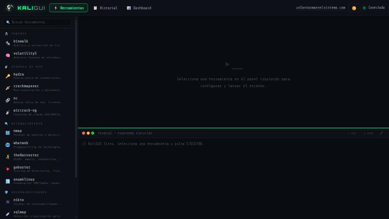
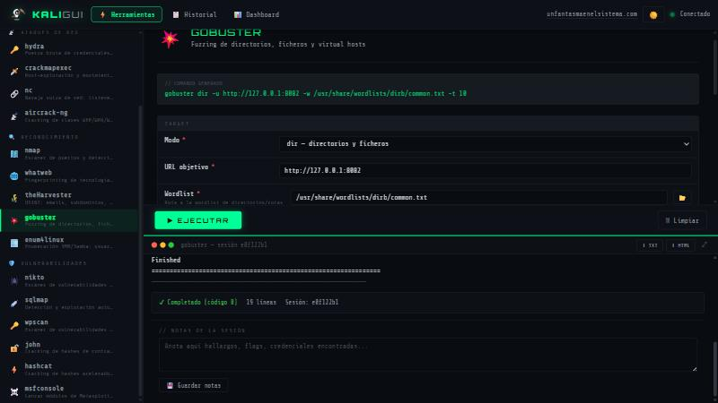
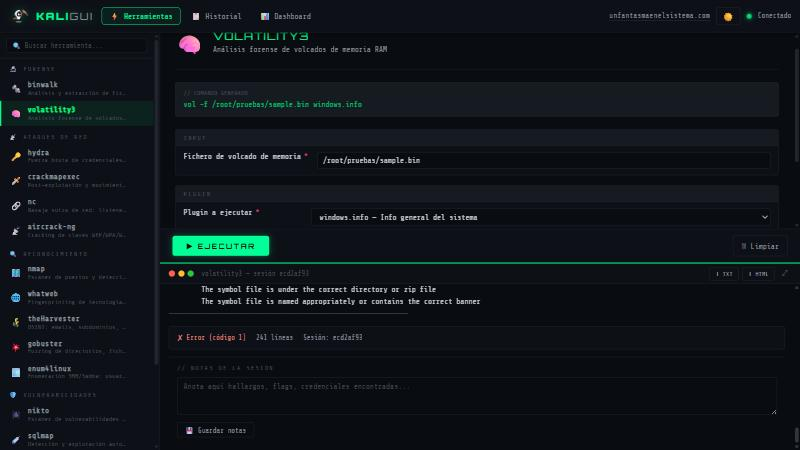
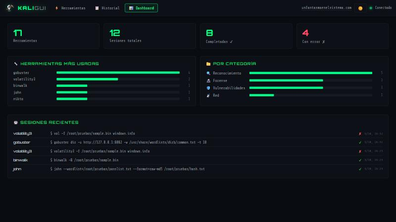

# KaliGUI 👻

Interfaz web local para herramientas CLI de Kali Linux. Pensada para prácticas de CTF con máquinas virtuales en VirtualBox/Docker.

**[unfantasmaenelsistema.com](https://www.unfantasmaenelsistema.com)**

---

## Capturas

| | |
|---|---|
|  |  |
|  |  |

---

## Instalación rápida

```bash
chmod +x install.sh
./install.sh
```

El script de instalación se encarga de todo: dependencias Python, entorno virtual, verificación de herramientas de Kali, descompresión de wordlists y creación del acceso directo en el escritorio.

### Arrancar

```bash
./start.sh
```

Luego abre el navegador en `http://localhost:5000` (desde Kali) o `http://<IP-de-Kali>:5000` (desde el host).

### Instalación manual

```bash
python3 -m venv venv
source venv/bin/activate
pip install -r requirements.txt
python3 app.py
```

---

## 🔐 Autenticación

KaliGUI escucha en todas las interfaces de red (necesario para acceder desde
el host vía reenvío de puertos de VirtualBox), así que **pide usuario y
contraseña** antes de dejar lanzar ninguna herramienta — sin esto, cualquiera
que llegara al puerto podría ejecutar `nmap`/`sqlmap`/`hydra`/`msfconsole`
contra cualquier objetivo sin autenticarse.

- `install.sh` genera la contraseña automáticamente (paso `[6/6]`) y la
  muestra al final de la instalación.
- Se guarda en el fichero local `.kaligui_auth` (permisos `600`, nunca se
  sube a git). Si lo pierdes, bórralo y reinicia KaliGUI: se genera uno
  nuevo.
- Usuario: `kaligui` — Contraseña: la que te haya mostrado la instalación
  (o el primer arranque, si no pasaste por `install.sh`).
- El navegador te pedirá las credenciales la primera vez que accedas a cada
  origen (`localhost:5000`, `<IP>:5000`...); las recordará mientras la
  pestaña/sesión del navegador siga abierta.

---

## Acceso desde VirtualBox / Docker

| Escenario | URL |
|---|---|
| Navegador dentro de Kali | `http://127.0.0.1:5000` |
| Desde el host (port forwarding) | `http://localhost:5000` |
| Desde el host (IP directa) | `http://192.168.X.X:5000` |
| Máquina víctima en Docker | Apuntar a la IP del contenedor (`docker inspect`) |

Para acceso desde el host en VirtualBox: **Red → Reenvío de puertos → guest 5000 → host 5000**.

> En todos los casos el navegador pedirá las credenciales de `.kaligui_auth` (ver [Autenticación](#-autenticación)).

---

## Herramientas incluidas (17)

### 🔍 Reconocimiento
| Herramienta | Descripción |
|---|---|
| `nmap` | Escáner de puertos y detección de servicios/OS |
| `whatweb` | Fingerprinting de tecnologías web |
| `theHarvester` | OSINT: emails, subdominios, IPs |
| `gobuster` | Fuzzing de directorios, ficheros y subdominios |
| `enum4linux` | Enumeración SMB/Samba completa |

### 🛡️ Vulnerabilidades
| Herramienta | Descripción |
|---|---|
| `nikto` | Escáner de vulnerabilidades web |
| `sqlmap` | Detección y explotación de SQL injection |
| `wpscan` | Escáner específico para WordPress |
| `john` | Cracking de hashes (John the Ripper) |
| `hashcat` | Cracking acelerado por GPU |
| `msfconsole` | Módulos de Metasploit Framework |

### 📡 Ataques de Red
| Herramienta | Descripción |
|---|---|
| `hydra` | Fuerza bruta de credenciales |
| `crackmapexec` | Post-explotación en redes Windows/AD |
| `nc` | Netcat: listeners, shells inversas, port scan |
| `aircrack-ng` | Cracking de claves WEP/WPA/WPA2 |

### 🔬 Forense
| Herramienta | Descripción |
|---|---|
| `binwalk` | Análisis y extracción de firmwares |
| `volatility3` | Análisis forense de volcados de memoria RAM |

---

## Funcionalidades

- **Terminal en tiempo real** — output línea a línea vía WebSockets con coloreado automático
- **Validación de campos** — doble capa (frontend + backend) antes de ejecutar
- **Wordlist browser** — explorador de `/usr/share/wordlists` y SecLists integrado en el formulario
- **Cheatsheet por herramienta** — 52 ejemplos reales de CTF; un clic rellena el formulario
- **Exportar resultados** — TXT plano o HTML con formato desde el terminal o el historial
- **Historial de sesiones** — todas las ejecuciones guardadas en JSON con el comando completo
- **Dashboard** — estadísticas de uso, herramientas más usadas y sesiones recientes
- **Modo claro/oscuro** — con persistencia en localStorage
- **Preview del comando** — muestra el comando exacto que se va a ejecutar antes de lanzarlo

---

## Changelog

**2026-10-05 — Seguridad: autenticación obligatoria + XSS en informe HTML**

- 🔐 El servidor escuchaba en `0.0.0.0:5000` sin ningún tipo de autenticación: cualquiera que llegara al puerto (red local, o el reenviado desde VirtualBox) podía lanzar `nmap`/`sqlmap`/`hydra`/`msfconsole` contra cualquier objetivo. Ahora pide usuario/contraseña (ver [Autenticación](#-autenticación)).
- 🐛 **XSS real** en el informe HTML exportado (`/api/sessions/<id>/export/html`): no escapaba `command`, `tool`, `id` ni las fechas, solo el *output*. Un payload en campos sin validar (p.ej. "Flags adicionales") se ejecutaba al abrir el informe.

**2026-10-05 — Fixes tras una prueba real end-to-end** (clon limpio, instalación desde cero en Kali, ejecución real de cada herramienta contra objetivos de laboratorio propios, no solo revisión de código):

- 🐛 **La app no arrancaba siguiendo el README tal cual.** Con las versiones actuales de Flask-SocketIO/Werkzeug, `socketio.run()` (modo `threading`) exige `allow_unsafe_werkzeug=True` o lanza `RuntimeError` y la app crashea al instante. Corregido en `app.py`.
- 🐛 **`volatility3` fallaba siempre** con `[ERROR] Herramienta no encontrada`. El paquete (pip o apt) instala el binario como `vol`, nunca como `volatility3` — comprobado vía `entry_points` del paquete. Corregido en `tools/forensics/volatility.py`.
- 🐛 **`gobuster` fallaba con los valores por defecto del formulario.** El campo "Códigos HTTP a mostrar" venía precargado con `-s ...`, pero gobuster ≥3.6 ya aplica su propia blacklist (`-b 404`) y rechaza combinar ambas. Se dejó el campo vacío por defecto en `tools/recon/gobuster.py`.
- 🐛 **El Dashboard y el Historial no mostraban las sesiones en orden real.** Se ordenaban por el nombre de fichero (un UUID aleatorio), no por la hora de inicio. Corregido en `app.py` (nueva función `_load_sessions()`, usada por `/api/sessions` y `/api/dashboard`).
- 🧹 Se eliminaron del repositorio los `.pyc` de `__pycache__/` que estaban commiteados por error y se añadió `.gitignore` (`__pycache__/`, `venv/`, `sessions/*.json`).

Herramientas verificadas con ejecución real tras los fixes: `nmap`, `gobuster`, `sqlmap`, `hydra`, `nikto`, `john`, `binwalk`, `volatility3`. El resto (`whatweb`, `theHarvester`, `enum4linux`, `wpscan`, `hashcat`, `crackmapexec`, `aircrack-ng`, `msfconsole`, `nc`) se instalaron correctamente pero no se ejecutaron en esta pasada — si ves algo raro en alguna, abre un issue.

---

## Añadir una herramienta nueva

1. Crear `tools/<categoria>/mi_herramienta.py`
2. Heredar de `Tool` y declarar `name`, `category`, `icon`, `fields` y `build_command()`
3. Opcionalmente añadir reglas de validación en los `ToolField` (`required`, `pattern`, `min_val`, `max_val`)
4. Registrar en `tools/__init__.py`
5. Añadir ejemplos en `cheatsheets.py` (opcional pero recomendado)

```python
# Ejemplo mínimo — tools/recon/mi_tool.py
from tools.base import Tool, ToolField

class MiTool(Tool):
    name = "mi-tool"
    description = "Descripción breve"
    category = "recon"   # recon | vuln | network | forensics
    icon = "🔧"
    fields = [
        ToolField("target", "Objetivo", "text", required=True,
                  placeholder="192.168.1.10"),
    ]

    def build_command(self, params: dict) -> list[str]:
        return ["mi-tool", params["target"]]
```

---

## Estructura del proyecto

```
kaligui/
├── install.sh          # Instalador completo
├── start.sh            # Script de arranque (generado por install.sh)
├── app.py              # Servidor Flask + Socket.IO
├── cheatsheets.py      # Ejemplos CTF por herramienta
├── requirements.txt    # Flask, Flask-SocketIO
├── tools/
│   ├── base.py         # Clase base Tool + validación
│   ├── __init__.py     # Registro de herramientas
│   ├── recon/          # nmap, whatweb, theHarvester, gobuster, enum4linux
│   ├── vuln/           # nikto, sqlmap, wpscan, john, hashcat, msfconsole
│   ├── network/        # hydra, crackmapexec, nc, aircrack-ng
│   └── forensics/      # binwalk, volatility3
├── templates/
│   └── index.html      # SPA — toda la UI
└── sessions/           # Historial JSON (creado automáticamente)
```

---

## Requisitos

- **Kali Linux** (o Debian/Ubuntu/Parrot compatible)
- **Python 3.8+**
- Las herramientas de Kali que quieras usar instaladas (`install.sh` las comprueba y ofrece instalarlas)

---

## Pendiente / Roadmap

- [ ] Notas por sesión
- [ ] Importar lista de targets para lanzar la misma herramienta contra varios hosts
- [ ] Gestión de procesos en background (ver qué está corriendo)
- [ ] Modo oscuro/claro por herramienta (tema por categoría)
